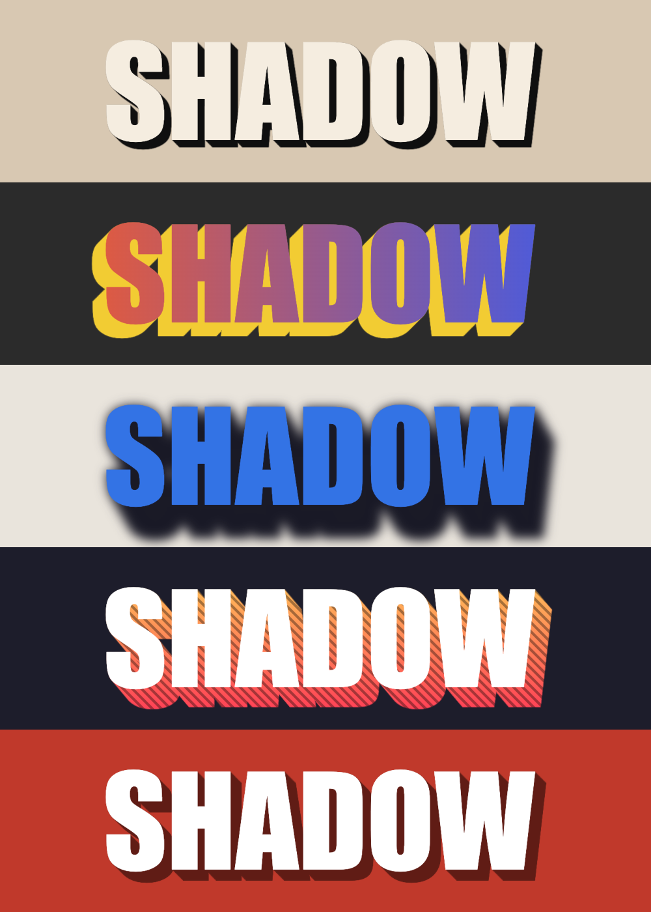

# BlockShadow

A Matchbox shader for Autodesk Flame that builds a solid, block style drop
shadow from a matte. The matte is extruded along an angle, optionally
softened with a gaussian blur, then the fill (a flat colour or the Front
input) is comped over it.

*From top: Fill Colour with a hard shadow (Angle -45, Length 16). The Front
as the fill (Angle -135, Length 30). A soft shadow (Angle -60, Length 60,
Softness 8). A striped gradient from the Shadow Fill input (Angle -50,
Length 40). Shadow Opacity 0.5 (Angle -45, Length 24). Shown comped over
a background.*

## Files

| File | Purpose |
| --- | --- |
| `AM_BlockShadow.1.glsl` | Pass 1: builds the fill and carries the matte |
| `AM_BlockShadow.2.glsl` | Pass 2: extrudes the matte into the block shadow |
| `AM_BlockShadow.3.glsl` | Pass 3: blurs the shadow horizontally |
| `AM_BlockShadow.4.glsl` | Pass 4: blurs the shadow vertically and comps the fill over it |
| `AM_BlockShadow.xml` | UI definition: inputs, controls, layout |

Keep all five files together and keep the names as they are. Flame runs the
numbered passes in order and reads the `.xml` to build the node's UI.

## Install

1. Copy all four `AM_BlockShadow.*.glsl` files and `AM_BlockShadow.xml` into the
   same folder on your Flame workstation. A shared location such as
   `/opt/Autodesk/shared/matchbox/shaders/` makes it available to every
   project, but any folder Flame can browse to works.
2. In Batch, add a **Matchbox** node. In the file browser that opens, go to
   that folder and pick `AM_BlockShadow.1.glsl`.
3. Connect your Front (RGB) and Matte (A), and optionally a Shadow Fill,
   then use the node's Result and Matte outputs.

You can also load it the same way from a Matchbox in Action or on the
timeline where Matchbox effects are supported.

## Inputs

- **Front:** RGB. Required. The node's output resolution and tagged colour
  space come from this input. It's also the fill, unless **Use Fill
  Colour** is on. In that case its pixels aren't used, so you can connect
  any clip with the resolution and colour space you want, such as the same
  clip that feeds the Matte.
- **Matte:** the shape that casts the shadow. Required.
- **Shadow Fill:** RGB, optional. A gradient, texture or any other image to
  colour the shadow with. Only used when **Use Shadow Fill Input** is on.

## Controls

**Shadow**

- **Angle:** shadow direction in degrees. 0 is right, 90 is up, and the
  default of -45 is down-right.
- **Length:** how far the shadow extrudes, in pixels.
- **Softness:** gaussian blur on the shadow, in pixels (sigma). 0 keeps the
  edges hard.
- **Shadow Opacity:** how see-through the shadow is. 1 is solid, 0 is
  invisible. It affects both the RGB and the output matte.
- **Shadow Only:** output just the shadow, without the fill. The shadow isn't
  cut out where the fill sits, so comping the fill back over it gives the
  same result as the normal output.

**Fill**

- **Use Fill Colour:** fill with a flat colour instead of the Front input.
  Off by default.
- **Fill Colour:** the fill's colour. Only shown when Use Fill Colour is on.
- **Front Premultiplied:** turn on if the Front is already premultiplied by
  the matte, so it isn't multiplied again. Only shown when Use Fill Colour
  is off.

**Shadow Fill**

- **Use Shadow Fill Input:** colour the shadow with the Shadow Fill input
  instead of Shadow Colour. The input is lined up with the frame, not
  extruded with the shadow, so a gradient stays put as the shadow moves.
- **Shadow Colour:** the shadow's colour. Only shown when Use Shadow Fill
  Input is off.

## Outputs

- **RGB:** the fill comped over the shadow, premultiplied.
- **Alpha / Matte:** the fill and shadow mattes combined.

With **Shadow Only** on, RGB is the premultiplied shadow and the matte is
the shadow's matte alone.

## Notes

- The shadow takes one sample per pixel of Length, capped at 4096, so very
  long shadows cost more to render.
- Each blur pass takes about 6 × Softness samples per pixel. Softness is
  capped at 340, and large values are slower too.
- Anything outside the frame is treated as empty, so mattes touching the
  frame edge don't smear into the shadow.
